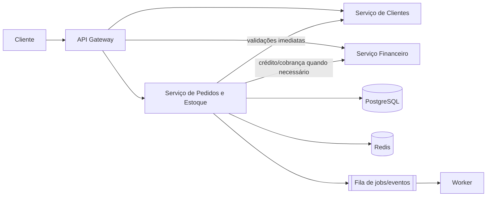

# Parte 1: Arquitetura e Organização

## Questão 1

Antes de separar Pedidos e Estoque, eu avaliaria: eles mudam juntos ou têm ciclos independentes? Possuem cargas muito diferentes? A reserva exige consistência imediata? Outros módulos também consomem Estoque? Existem equipes e necessidades operacionais distintas? Essas respostas indicariam se a autonomia compensa o custo de comunicação distribuída.

Como o enunciado não fornece esses dados e os dois domínios participam de operações fortemente relacionadas, eu começaria com um único serviço de **Pedidos e Estoque**, mantendo os módulos internos separados. Criar um pedido costuma envolver verificar disponibilidade, reservar itens, confirmar a baixa ou desfazer a reserva. Dentro do mesmo serviço, essas operações podem permanecer locais e, quando necessário, participar da mesma transação. Eu extrairia Estoque quando métricas, consumidores independentes ou limites organizacionais justificassem assumir latência, falhas de rede, retries, idempotência e consistência eventual.

Clientes e Financeiro continuariam como serviços independentes e donos dos próprios dados. O serviço de Pedidos e Estoque não acessaria diretamente os bancos desses módulos.



### Comunicação síncrona e assíncrona

Eu usaria comunicação síncrona quando a resposta fosse necessária para concluir a operação apresentada ao usuário. Um exemplo é impedir a criação de um pedido para um cliente bloqueado. Mesmo nesses casos, timeout e falha da dependência precisam ser tratados de forma explícita; retry automático só é seguro quando a operação é idempotente.

Processamento assíncrono é mais adequado quando o efeito pode acontecer depois da resposta, como notificações, geração de documentos ou alerta de estoque baixo. Para esta prova, Redis com ARQ é proporcional ao job implementado. Se o alerta passasse a ter impacto operacional crítico, eu revisaria garantias de entrega, idempotência e recuperação antes de manter a mesma solução em produção.

### PostgreSQL e Redis

O PostgreSQL seria a fonte de verdade transacional. Mesmo que os módulos de Pedidos e Estoque comecem no mesmo serviço, eu manteria tabelas e responsabilidades separadas para não confundir os domínios.

Usaria Redis para dados temporários, cache-aside e coordenação curta. Não trataria cache como fonte para reservar ou baixar estoque. Também evitaria depender de Pub/Sub efêmero em eventos cujo desaparecimento provoque perda financeira ou inconsistência de negócio.

### API Gateway

O Gateway concentra preocupações de entrada: TLS, autenticação, rate limiting, roteamento, correlação e versionamento. Eu não colocaria regras de pedido, crédito ou estoque nele, porque isso espalharia lógica de negócio para uma camada difícil de testar e evoluir junto com o domínio.

### Observabilidade

Começaria com logs estruturados contendo request ID, métricas e tracing distribuído nas chamadas entre serviços. Prometheus e Grafana atendem métricas e dashboards; OpenTelemetry permite correlacionar uma requisição entre API, serviços e worker.

Num ERP, eu priorizaria disponibilidade, taxa de erros, p95/p99, tempo e falhas de integrações, tamanho/idade das filas e operações que deixem pedido, estoque e financeiro inconsistentes. Logs de auditoria merecem tratamento separado dos logs técnicos: precisam identificar ação e resultado sem registrar senhas, tokens ou dados sensíveis desnecessários.

## Questão 2

Eu usaria esta estrutura como ponto de partida:

```text
src/app/
├── api/routes       # entrada HTTP, status codes e dependências
├── core             # settings, segurança, cache e infraestrutura
├── db               # engine e sessões
├── schemas          # contratos Pydantic
├── models           # modelos SQLAlchemy
├── repositories     # consultas e persistência
├── services         # regras e orquestração
├── seed.py          # carga inicial idempotente
└── worker.py        # jobs assíncronos
tests/
```

Routers traduzem HTTP para chamadas da aplicação e não montam SQL. Repositories concentram acesso a dados e não decidem status code. Services mantêm regras e coordenam persistência, cache ou ferramentas sem depender da camada HTTP. Schemas e models são separados porque o contrato externo não precisa reproduzir todas as decisões de armazenamento.

Essa organização é inspirada em responsabilidade única e inversão de dependência, além de um DDD leve nas fronteiras. Eu não criaria interfaces para cada classe apenas para cumprir um padrão. A abstração precisa proteger algo que realmente varia — banco, integração externa ou regra — e tornar o comportamento mais fácil de testar e manter.
